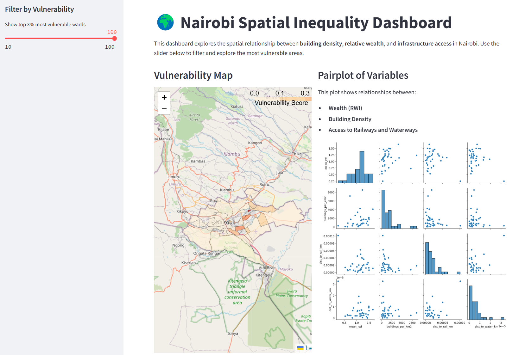

# Spatial Analysis of Economic Inequality in Nairobi

## Overview
This project visualizes intra-urban economic disparities in Nairobi using open data (OSM, Humanitarian Data Exchange etc.).

## Data Sources
- OpenStreetMap (OSM)
  - Buildings, Railways, Waterways: https://download.geofabrik.de/africa/kenya.html
- Humanitarian Data Exchange
  - Administrative Wards: https://data.humdata.org/dataset/administrative-wards-in-kenya-1450
  - Relative Wealth Index: https://data.humdata.org/dataset/relative-wealth-index/resource/15d09fc4-8d0e-46f4-8a6b-c7580f9387b8

**In particular, some building count files (.dbf, .shp) are too large to be uploaded in this repository and should be downloaded from the website for reproduction.**

## Goals
- Visualize estimated vulnerable areas considering infrastructure accessibility at high spatial resolution (Streamlit, Q-GIS [optional])
- Explore spatial clusters of deprivation

## Tools
- QGIS 3.40.6 [optional]
- Python 3.12.9 (GeoPandas)

## 🌍 Nairobi Spatial Inequality Dashboard

This Streamlit dashboard visualizes spatial inequality in Nairobi by combining:

- **Building density**
- **Relative Wealth Index (RWI)**
- **Proximity to railways and waterways**

## 🖥️ Features

- Interactive map of vulnerable wards (high density, low wealth)
- Slider to filter top X% most vulnerable areas
- Pairplot showing variable relationships

## 📦 Setup

```bash
git clone https://github.com/Mitsuhiro-ODAKA/poverty-inequality-nairobi.git
cd poverty-inequality-nairobi
pip install -r requirements.txt
streamlit run app.py


